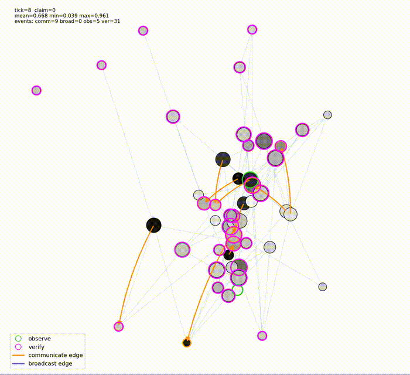

# Simulation Lab: Social Network Behavior Experiments

<p align="center">
  
</p>

This repository is a simulation lab for studying belief dynamics and information diffusion in directed social networks. It provides a simulation kernel, telemetry system, and live visualization for observing how agents interact, exchange information, and update beliefs over time.

---

## Features

### 1. **Simulation Kernel**
The simulation kernel models a directed social network where agents:

- **Receive passive observations** from the world with noisy evidence
- **Communicate** beliefs to specific neighbors
- **Broadcast** beliefs to all outgoing neighbors
- **Verify** claims with direct evidence
- **Update** beliefs from accumulated memories using trust-weighted learning

The kernel supports:

- Configurable world and agent parameters through YAML config files
- Dynamic belief updates based on memory and evidence
- Per-step snapshots capturing full belief state and event data

### 2. **Telemetry System**
The telemetry system tracks simulation metrics across all agents and claims:

- Global belief statistics (mean, std, min, max)
- Belief change deltas between steps
- Event counts (observations, verifications, communications, broadcasts)
- Step runtime measurement
- Export to CSV and JSONL formats

### 3. **Visualization System**
The visualization system renders the social network in real time, allowing you to observe:

- Agent positions and belief states
- Directed communication and broadcast edges
- Overlays for observed, verified, and receiving agents
- Interactive tooltips for detailed agent information

### 4. **Configuration**
Simulation scenarios are defined in `configs/` and loaded through `config.py`.

Current example configs include:

- `configs/default.yaml`
- `configs/high_noise.yaml`

See the [model documentation](docs/model.md) for details on the simulation design.

---

## Getting Started

### 1. **Set Up the Environment**
Install the required dependencies using uv:

```bash
uv sync
```

### 2. Run the Simulation
Run the simulation with visualization:

```bash
uv run python -m simlab
```

Run a different scenario:

```bash
uv run python -m simlab --config configs/high_noise.yaml
```

Adjust runtime/view parameters (use `-h` for help):

```bash
uv run python -m simlab --config configs/default.yaml --steps 1000 --pause-time 0.05
```

### 3. Telemetry Options
Control logging frequency:

```bash
uv run python -m simlab --log-every 5
```

Export telemetry after the run:

```bash
uv run python -m simlab --export-telemetry-csv output.csv
uv run python -m simlab --export-telemetry-jsonl output.jsonl
```

---

## Next Steps

Planned directions for the project include:

- Adding more scenario presets and config-driven experiments
- Improving telemetry metrics for action selection and belief alignment
- Writing notebook-based case studies for specific simulation runs
- Exploring heterogeneous agent profiles and alternative network structures
- Extending the decision model toward explicit utility or expected utility
- Investigating richer trust dynamics and misinformation behaviors
