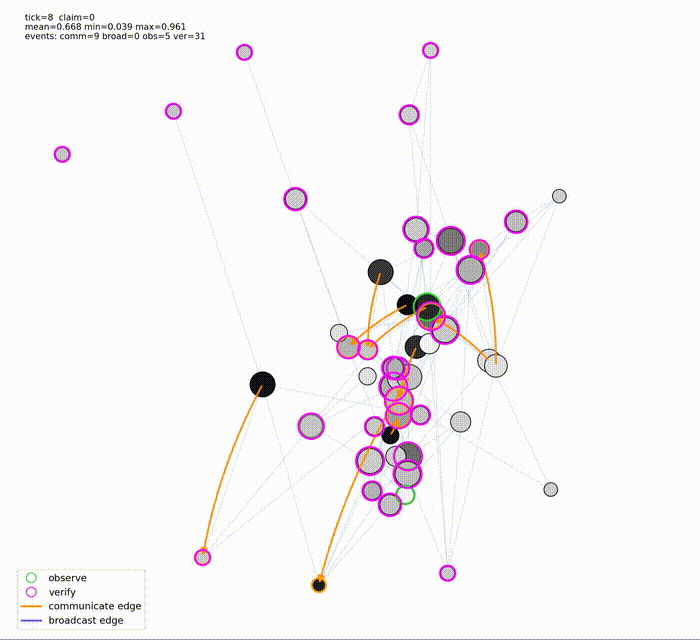

# Simulation Lab: Belief Dynamics on Social Networks

<p align="center">
  
</p>

An agent-based simulation of how beliefs spread and update on a directed social network. Agents form beliefs from three distinct information channels — passive observation, active verification, and secondhand hearing from neighbors — and weigh new evidence against how much they trust its source. Each run is config-driven, deterministic, and fingerprinted, so the same scenario always reproduces the same result and different scenarios are never mistaken for the same one.

See [`docs/model.md`](docs/model.md) for the full belief-update model and [`docs/config.md`](docs/config.md) for the YAML config reference.

---

## Getting Started

```bash
pip install -e .
```

This installs `simlab-viz` and `simlab-run` (equivalently `python -m simlab.viz_cli` / `python -m simlab.runner`). Pass `-h` to either for the full list of flags.

### Visualization

Live matplotlib view of the network as it runs:

```bash
simlab-viz --config configs/default.yaml --steps 500
```

### Headless runs

No visualization; writes a self-contained, reproducible run artifact (`manifest.json`, `summary.json`, `trajectory.csv`) to `<output-dir>/<run-id>/`:

```bash
simlab-run --config configs/default.yaml --steps 500
```
</content>
